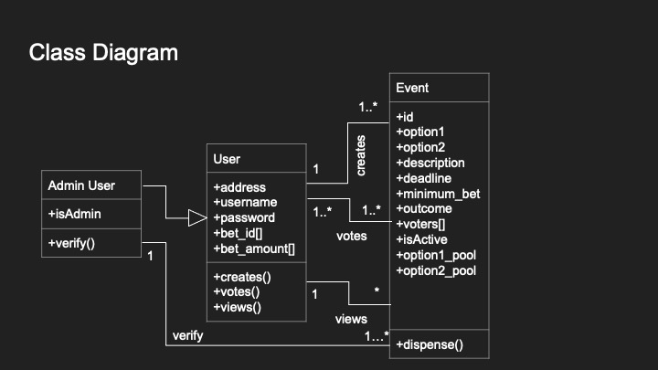

# FT5004_POOLLE

Contributors: Evelyn Chen; Lo, Yin-fan; Liang Xin

FT5004 project POOLLE

Dive into the cash POOL, 
Vote in captivating POLLs, 
and Unite diverse POLEs of opinion.

## Use Cases
The users will be welcomed by the login page:

After the login, the users will see a list of the events in the system.

Let's say the user wants to look into the Baiden vs Trump event.

The user clicks on Baiden's photo, and gets directed to the voting page, the options are prepopulated by the click selection.

After the voting, the user gets redirected to the page that lists the events.

Let's say the user wanted to create a new event, and clicks the create button.

The user fills in the details of the event as per the screenshot below.

The user gets redirected to the page that lists the events, and sees the event he/she just added.

## UML Diagrams

## Instructions
Clone the github repository.

`git clone https://github.com/e0313687/FT5004_POOLLE.git`

`cd` to where the repository is cloned at.

`truffle compile`

Open Ganache.

`truffle migrate`

`truffle test`

